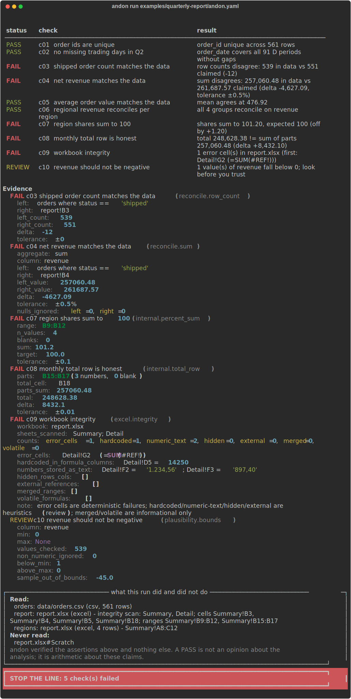

# andon

<!-- mcp-name: io.github.gulmezeren2-byte/andon -->

**Stop the line when the numbers don't add up.**

[](https://github.com/gulmezeren2-byte/andon/actions/workflows/ci.yml)
[](pyproject.toml)
[](LICENSE)

andon re-checks the numbers in finished analysis — the report your AI agent just drafted,
the workbook a colleague "quickly updated" — against the data they came from and against
themselves. It does this with arithmetic, not with another LLM: reconciliation,
internal consistency, schema contracts and Excel workbook integrity, written down as a
small YAML spec and enforced with exit codes.



That screenshot is real output. The example it runs on is in
[`examples/quarterly-report/`](examples/quarterly-report/), staged by a script that
plants the defects I keep meeting in real reporting work: a count taken from a stale
snapshot, a revenue total typed over by hand, shares that sum to 101.2, a total row
nobody updated after a data refresh, a `#REF!`, and freight numbers stored as text.

## Why this exists

I'm an industrial engineer. I build and run operations reporting — delivery KPIs,
forecast accuracy, inventory analytics — and over the last two years an increasing share
of the first drafts around me has been written by AI agents. They are fast, tireless,
and confidently wrong in ways a tired human is not: the filter that silently dropped
cancelled orders, the percentage column that almost sums to 100, the total row that
survived three edits of its parts.

The common answer is to ask a second model to review the first one. I think that is the
wrong tool. Whether 539 rows really sum to 257,060.48 is not a matter of opinion, and no
amount of model capability makes an opinion the right instrument for it.

Manufacturing solved this problem decades ago. On a Toyota line, any worker who spots a
defect pulls a cord — the *andon* — and the line stops until the problem is understood.
The machine equivalent, *jidoka*, is a machine that stops itself when it detects an
abnormal condition. This tool is that cord for spreadsheets and reports: a small,
deterministic gate between "the analysis is written" and "the analysis is sent."

## The iron rules

andon's behavior is easier to trust because it is constrained. These rules are enforced
in code, not just promised here:

1. **Only arithmetic can fail the build.** Heuristic checks (distribution shifts,
   plausibility bounds) can raise a REVIEW flag; the engine will not let them FAIL, even
   if a buggy check tries.
2. **No silent blessings.** Every report ends with what was read, what was skipped, and
   which worksheets were never touched (the report calls this the honesty block). A
   PASS covers the listed assertions and nothing else.
3. **A check that can't run is a finding, not a pass.** Missing file, unreadable range,
   text in a numeric column — the run continues, the check is recorded as ERROR, and the
   exit code is non-zero. "Not verified" must never be readable as "fine."
4. **Read-only by construction.** There is no code path that writes to your data.

## Install

```
pip install andon-verify
```

The PyPI distribution is named `andon-verify` (the bare `andon` name was already
taken); the command and the import stay `andon` — `andon run ...`, `import andon`.
From source: `pip install git+https://github.com/gulmezeren2-byte/andon`.

## Quick start

Point andon at data and claims:

```yaml
# andon.yaml
version: 1

sources:
  orders: data/orders.csv
  report: out/weekly.xlsx#Summary

checks:
  - name: no dropped orders
    reconcile.row_count:
      left:  { source: orders, where: "status != 'cancelled'" }
      right: { source: report, cell: B4 }

  - name: revenue adds up
    reconcile.sum:
      column: revenue
      left:  { source: orders, where: "status != 'cancelled'" }
      right: { source: report, cell: B6 }
      tolerance: 0.5%

  - name: totals row is honest
    internal.total_row:
      source: report
      parts: B10:B21
      total: B22
      tolerance: 0.01

  - name: workbook is mechanically sound
    excel.integrity:
      source: report
```

```
andon run andon.yaml            # human-readable verdict
andon run andon.yaml --json     # full machine-readable report
andon inspect out/weekly.xlsx   # integrity-scan a workbook, no spec needed
andon init                      # write a commented starter spec
```

Or try the sabotaged example in this repo:

```
git clone https://github.com/gulmezeren2-byte/andon
cd andon/examples/quarterly-report
andon run andon.yaml
```

## What it checks

| Family | Checks | Question it answers | Can FAIL? |
|---|---|---|---|
| `reconcile` | `row_count`, `sum`, `aggregate`, `group_sum`, `keys` | Does the report agree with the data it came from? | yes |
| `internal` | `total_row`, `percent_sum`, `recompute` | Does the report agree with itself? | yes |
| `schema` | `columns`, `unique`, `not_null`, `allowed_values`, `date_continuity` | Is the data shaped the way everyone assumes? | yes |
| `excel` | `integrity` | Is the workbook mechanically sound? (`#REF!`, values typed over formulas, numbers stored as text — including the `1.234,56` flavor — hidden rows, external links) | on error cells |
| `plausibility` | `bounds`, `new_categories`, `mean_shift` | Should a human look at this before anyone trusts it? | no — REVIEW at most |

Full parameter reference with examples: [`docs/checks.md`](docs/checks.md).

## Exit codes and CI

Exit codes are a contract:

| code | meaning |
|---|---|
| 0 | every check passed |
| 1 | at least one FAIL (with `--strict`: also on REVIEW/ERROR/nothing-ran) |
| 2 | no failures, but REVIEW flags were raised |
| 3 | nothing was verified — a check could not run, or every check was skipped |
| 4 | the spec itself is broken |

As a GitHub Action — one line, and the verdict lands in your job summary:

```yaml
- uses: gulmezeren2-byte/andon@v1
  with:
    spec: reports/andon.yaml
    args: "--strict"
```

Or plainly, in any runner:

```yaml
- run: pip install andon-verify
- run: andon run reports/andon.yaml --strict --md verdict.md   # --md → a PR-comment-ready verdict
```

## As a pre-commit hook

Stop a commit before a broken report leaves your machine:

```yaml
# .pre-commit-config.yaml
repos:
  - repo: https://github.com/gulmezeren2-byte/andon
    rev: v0.3.0
    hooks:
      - id: andon
        args: ["reports/andon.yaml", "--strict"]
```

## Using andon with AI agents

andon is built to be *driven by* agents, not to contain one:

- `--json` emits the full report with stable field names; the exit code alone is enough
  for a go/no-go decision.
- Error messages name the sources, columns and sheets involved, so an agent can repair
  its own spec instead of guessing ("Column 'Revenue' not found. Columns are: region,
  share_pct, revenue").
- [`skills/verify-with-andon/`](skills/verify-with-andon/) ships a skill for Claude
  Code and compatible harnesses that teaches an agent the discipline: after drafting any
  analysis, write the spec, run andon, and report the verdict — including the rule that
  loosening a tolerance to make a check pass must be declared, never silent.
- **MCP server.** `pip install 'andon-verify[mcp]'` and run `andon-mcp` to expose three
  tools to any MCP-speaking runtime: `run` (execute a spec), `inspect` (integrity-scan a
  workbook with no spec), and `diff` (classify what changed between two versions). The
  agent gets the same structured verdict a human gets — not prose it has to parse back.

```jsonc
// e.g. Claude Desktop / Claude Code mcp config
{ "mcpServers": { "andon": { "command": "andon-mcp" } } }
```

No local Python? The [`Dockerfile`](Dockerfile) builds the same server:
`docker build -t andon . && docker run --rm -i -v "$PWD:/work:ro" -w /work andon`.

My working rule: the agent that wrote the analysis also writes the spec, and neither is
finished until `andon run` exits 0 — or a human has signed off on every flag it raised.

## What andon is not

- **Not a data-quality platform.** [Great Expectations](https://github.com/great-expectations/great_expectations)
  and [pandera](https://github.com/unionai-oss/pandera) validate data *inside pipelines*,
  in code, usually against a warehouse. andon verifies *claims in finished artifacts* —
  the report against its source — and treats Excel as a first-class citizen, because
  that is where analysis actually lives in most companies.
- **Not an LLM evaluator.** It doesn't score model outputs; it re-derives numbers.
- **Not a replacement for reading the report.** It removes a class of mechanical error
  so human review can spend itself on judgment.

## Limitations, honestly

- **Formula cells need cached values.** andon reads the value Excel last calculated. A
  workbook produced by a library and never opened in Excel/LibreOffice carries no cached
  values for its formulas; andon refuses to guess and reports exactly that.
- **`where` filters are pandas `query()` expressions.** They are expressive, which means
  a spec can encode the same mistakes as any query. Specs are code — review them like code.
- **Heuristic checks have false positives by design.** That is why they cannot fail a
  build.
- **Scale is untested beyond mid-size files.** Everyday operational workbooks and CSVs
  (hundreds of thousands of rows) are fine; nobody has benchmarked it against 10 GB of
  parquet. If you do, tell me what broke.
- Parquet sources need `pip install 'andon-verify[parquet]'`.

## CSV encoding and delimiter

A CSV source is read as utf-8 by default, and Excel's BOM is stripped so it can't poison
the first column name. When a file isn't utf-8 — Turkish exports out of Excel are often
`;`-separated and encoded cp1254 — give the source as a mapping instead of a bare path:

```yaml
sources:
  sales:
    path: data/satis.csv
    encoding: cp1254      # default: utf-8-sig
    delimiter: ";"        # default: ","
```

Get the encoding wrong and andon says so, naming the likely culprit — it does not
silently mojibake your column names and then "verify" them.

## Verify against a warehouse query (DuckDB)

A source can be a SQL query instead of a file — so you can reconcile a report against
the same data your BI tool reads, not just against a CSV. With
`pip install 'andon-verify[duckdb]'`, prefix a source with `duckdb:` and DuckDB runs it
(it reads CSV, parquet, JSON and `.duckdb` files inside the query; relative paths resolve
against the spec):

```yaml
sources:
  # the report's headline number
  report: out/q2.xlsx#Summary
  # the same number, straight from the raw data via SQL
  truth: "duckdb:SELECT SUM(revenue) AS rev FROM 'data/orders.parquet' WHERE status='shipped'"

checks:
  - name: revenue matches the warehouse
    reconcile.sum:
      column: rev
      left:  { source: truth }
      right: { source: report, cell: B6 }
      tolerance: 0.5%
```

## Diff two workbook versions

"Someone edited the workbook — what actually changed?" `git diff` on an .xlsx is noise,
and the tools that compare spreadsheets show every changed cell flat. `andon diff`
classifies each change instead, so a new `#REF!` doesn't hide behind reformatted dates:

```
andon diff last-week.xlsx this-week.xlsx
andon diff v1.xlsx v2.xlsx --tolerance 0.5%   # hide numeric moves below 0.5%
andon diff v1.xlsx v2.xlsx --json             # machine-readable
```

```
cell        change      before → after
Summary!B9  new_error   43.8 → #REF!
Summary!B4  numeric     261,687.57 → 266,687.57  (+5000, +1.91%)
```

A new error cell is called out on its own; numeric moves come with a delta and a percent.
Exit codes: 0 = nothing meaningful changed, 1 = a new error appeared (or, with `--strict`,
any change), 2 = changes but no new error.

## Roadmap

Shipped since 0.1: a [GitHub Action](#exit-codes-and-ci) and pre-commit hook, DuckDB
sources, `andon diff`, an [MCP server](#using-andon-with-ai-agents), and CSV
encoding/delimiter controls.

Near-term, in order:

- JSON / JSONL sources (an array of records, or one object per line)
- Row-level diff for data sheets, not just cell-by-cell

Not planned: dashboards, scheduled runners, LLM-powered anything inside the verifier.
The verifier stays deterministic; that is the point.

## How this project is built

I design the checks, decide the semantics and review every line; I use AI agents
(Claude Code) heavily for implementation speed, and the commit trailers say so. If that
bothers you, read `tests/` first: the suite builds real CSV and XLSX fixtures, no
mocks, and it is the contract. Tests don't care who typed them.

## License

[MIT](LICENSE) — Mehmet Eren Gülmez
